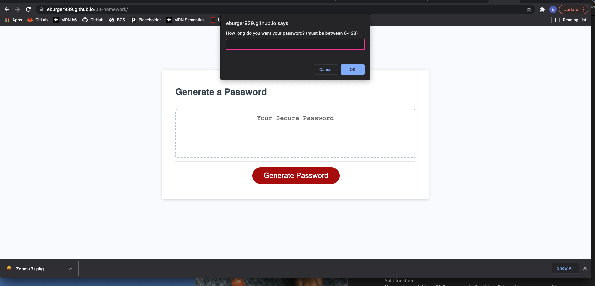

# Homework 
* Due on 12/9/2021
* Received assistance from my tutor Faran
* worked in collaboration with Ben, Taylor, Alix , Karrie, Richard, Logan, Emily

## Description
* created multiple web prompts/alerts that allowed a user to choose which elements they wanted included in their automatic password generator.  The window prompts allow the user to select the length of the password and whether they wanted uppercase, lowercase, numbers, or special characters within their password.  
* prompts/confirms were created for each section.  4 loops were ran for lowercase, uppercase, numbers and special characters to only the length that was specified by the user.  All characters from each section were added to a single array where a 4 loop was ran again to randomly choose characters at only the length that was specified by the suer. 

## Screen shot of final depolyed webpage

## Link to deployed application
* https://eburger939.github.io/password-generator/

